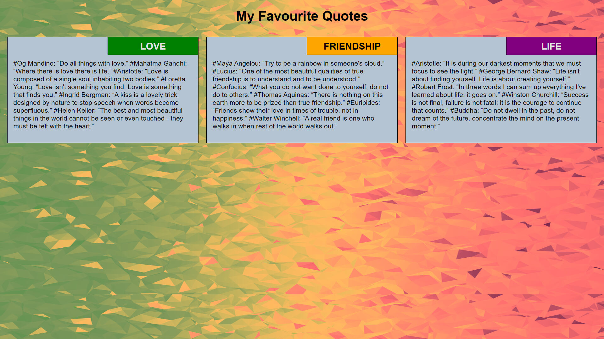
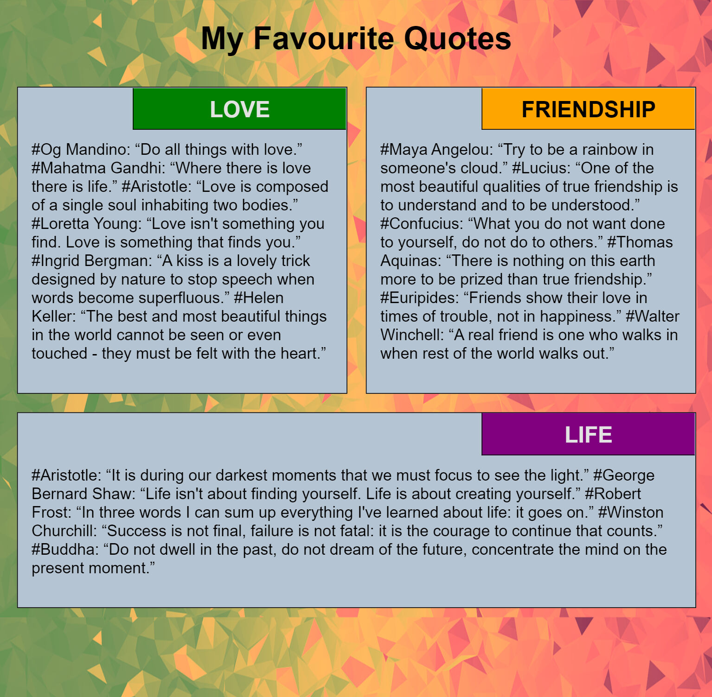
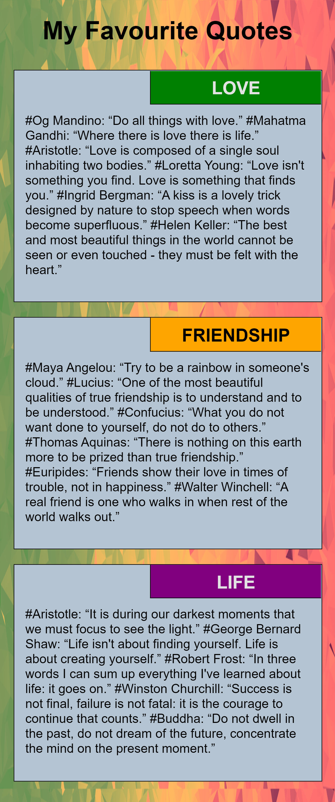

## Module-2 Coding Assignment

- [Webpage Link](#my-favourite-quotes)
- [Desktop Output Screen](#desktop-output-screen)
- [Tablet Output Screen](#tablet-output-screen)
- [Mobile Output Screen](#mobile-output-screen)

`Coursera Course: HTML, CSS, and Javascript for Web Developers by Johns Hopkins University`

## My Favourite Quotes [OUTPUT :computer: Link](https://guru-shreyansh.github.io/WebDev_JHU_HTML-CSS-JS/Module-2_Responsiveness/index1.html)
## Desktop Output Screen

## Tablet Output Screen

## Mobile Output Screen

