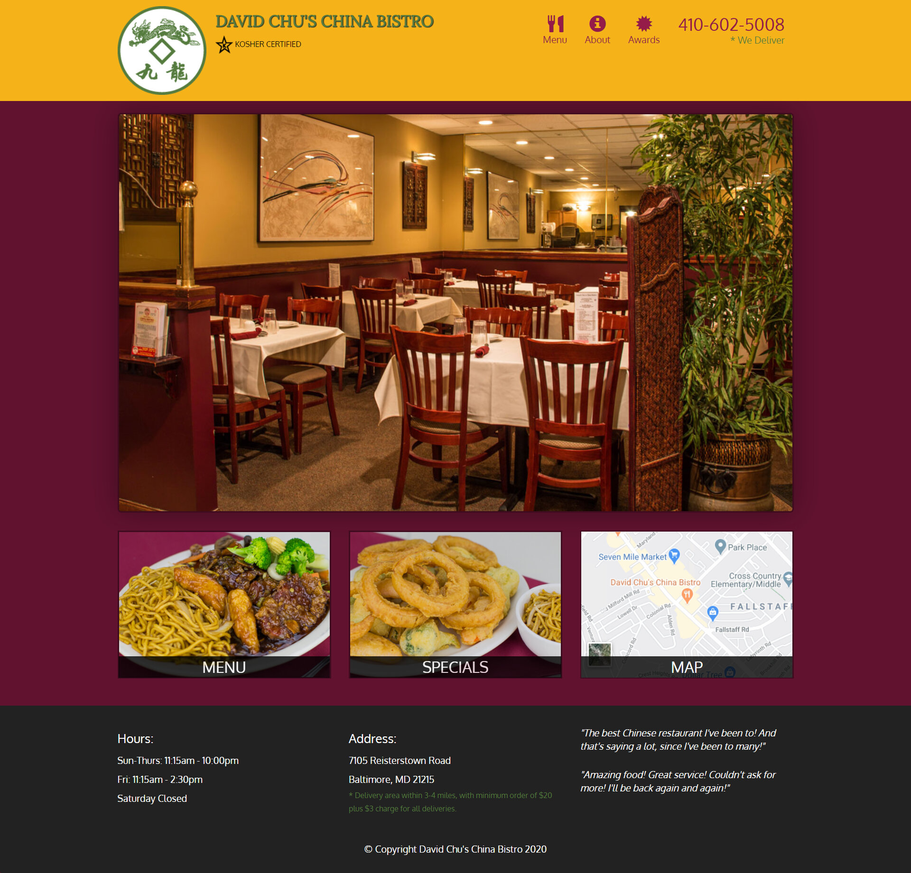
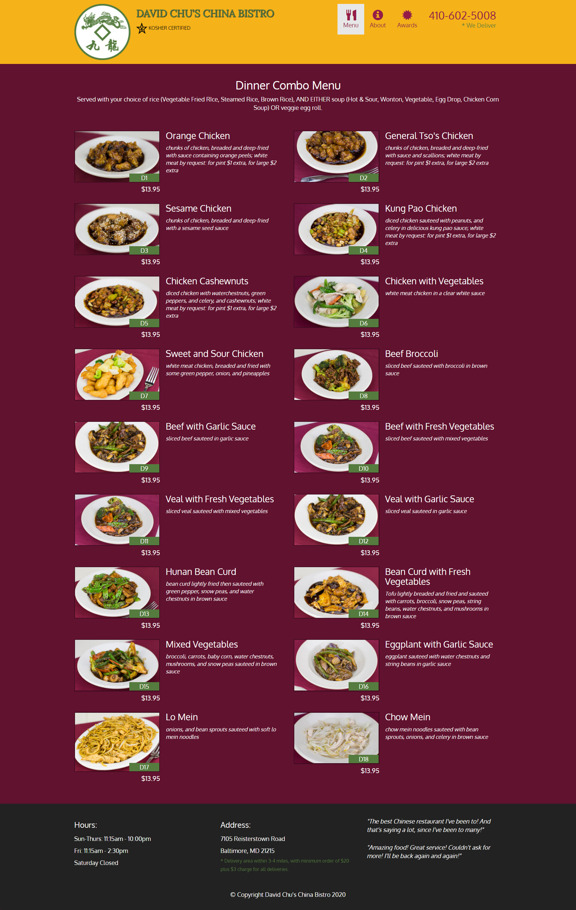
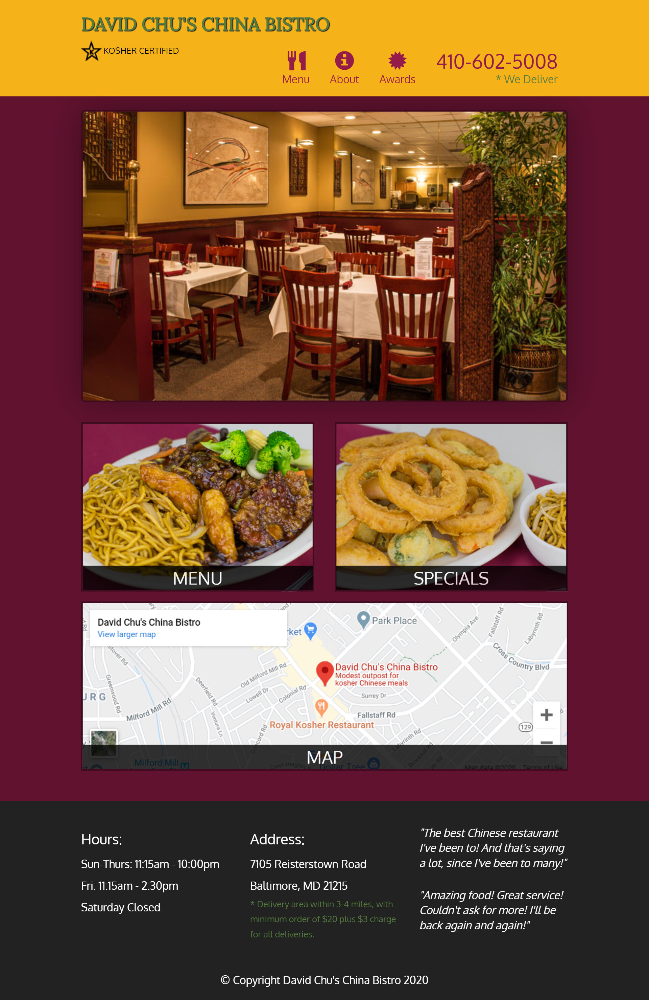
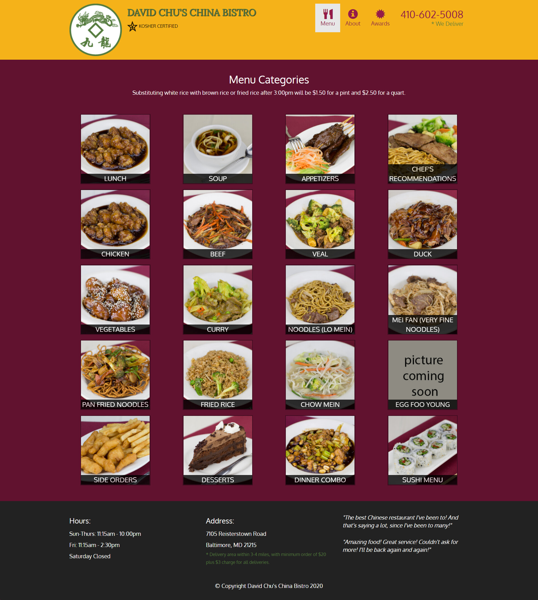

<h2>नमस्ते (Namaste):rabbit:, I'm Shreyansh Kumar Singh! </h2>

<em>ツ Σπɢιπεεя ♛ ᒪᕮᗩᖇᑎᕮᖇ ♞ Gⓐⓜⓔⓡ ✘ A ʀ ✞ ɪ ꜱ ✞  
</em>

## Module-5 Coding Assignment

- [Restaurant Link](https://guru-shreyansh.github.io/WebDev_JHU_HTML-CSS-JS/Module-5_Restaurant/index4.html)
- [Desktop Output Screen](#desktop-output-screen)
- [Specials Output Screen](#specials-output-screen)
- [Tablet Output Screen](#tablet-output-screen)
- [Menu Output Screen](#menu-output-screen)

`Coursera Course: HTML, CSS, and Javascript for Web Developers by Johns Hopkins University`

## David Chu's China Bistro : [OUTPUT :computer: Link](https://guru-shreyansh.github.io/WebDev_JHU_HTML-CSS-JS/Module-5_Restaurant/index4.html)
## Desktop Output Screen

## Specials Output Screen
## Tablet Output Screen

|  |  |
|:---:|:---:|

## Menu Output Screen

<em><b>I love connecting with different people</b> so if you want to say <b>Hi, I'll be happy to meet you!</b> 😊</em>
