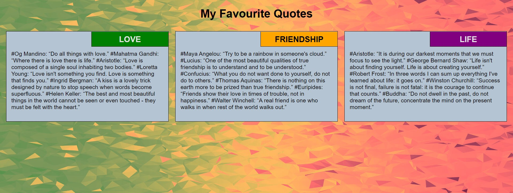
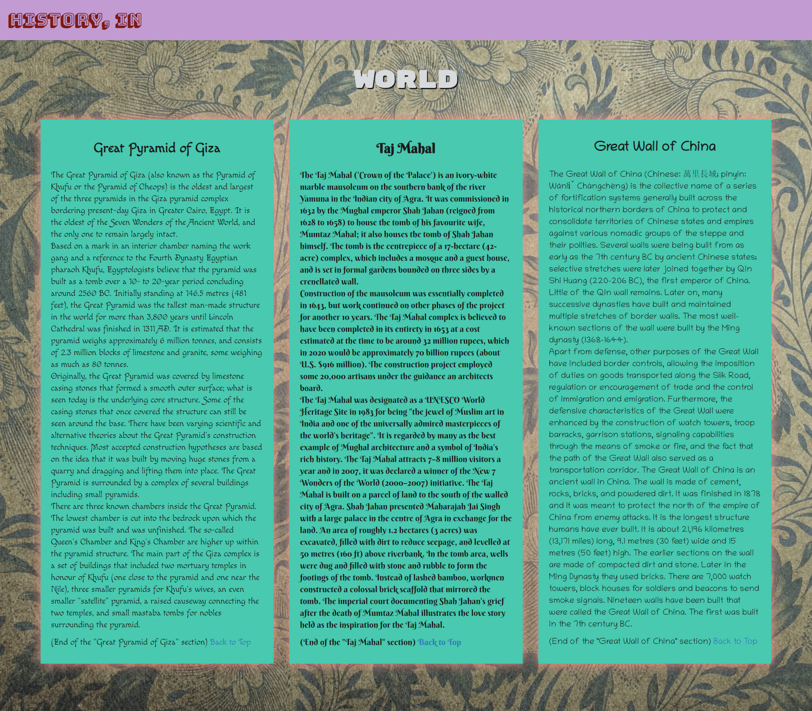
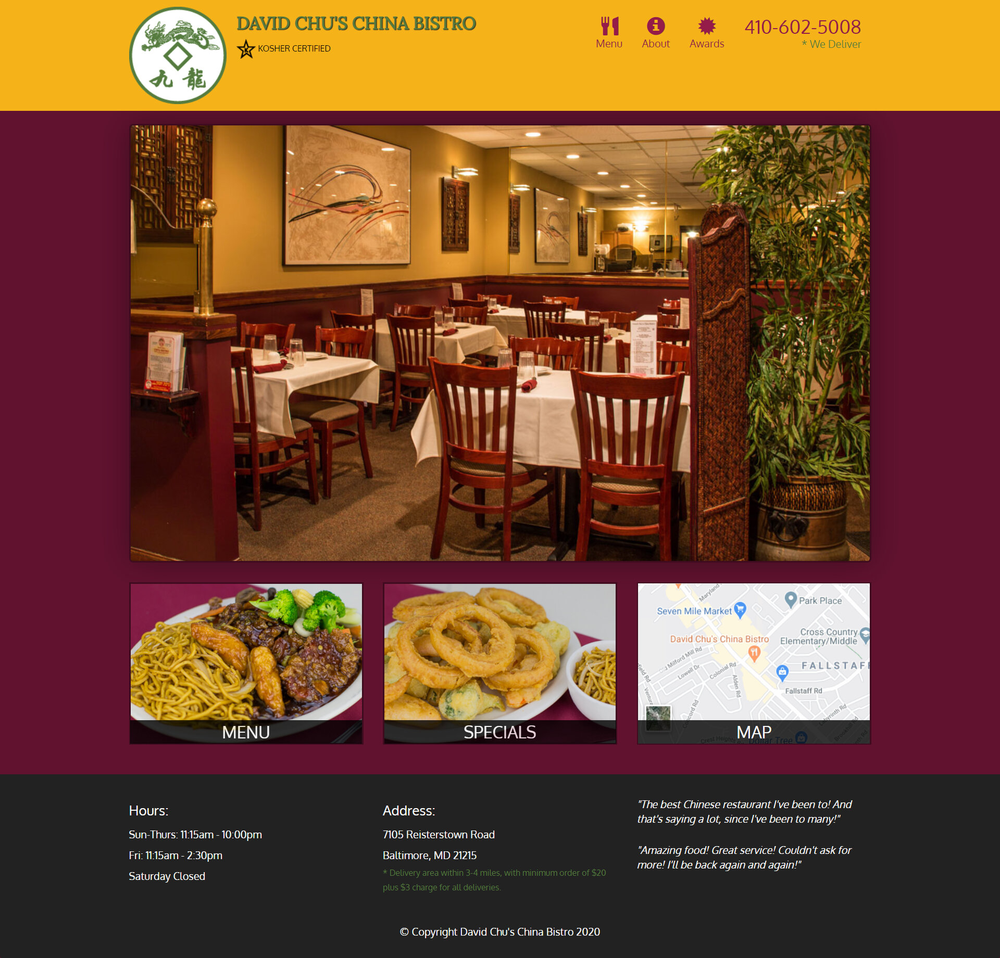

<h2>नमस्ते (Namaste):rabbit:, I'm Shreyansh Kumar Singh! </h2>

<em>ツ Σπɢιπεεя ♛ ᒪᕮᗩᖇᑎᕮᖇ ♞ Gⓐⓜⓔⓡ ✘ A ʀ ✞ ɪ ꜱ ✞  
</em>

## Module Coding Assignments Solutions

`Coursera Course: HTML, CSS, and Javascript for Web Developers by Johns Hopkins University`

>`C`
>`E`
>`R`
>`T`
>`I`
>`F`
>`I`
>`C`
>`A`
>`T`
>`E`

* **Module II** : [My Favourite Quotes](https://guru-shreyansh.github.io/WebDev_JHU_HTML-CSS-JS/Module-2_Responsiveness/index1.html)

`Responsiveness`
* **Module III** : [World Famous Monuments](https://guru-shreyansh.github.io/WebDev_JHU_HTML-CSS-JS/Module-3_TwitterBootstrap/index2.html)

`Twitter Bootstrap`
* **Module IV** : [Hello & Goodbye Printer](https://guru-shreyansh.github.io/WebDev_JHU_HTML-CSS-JS/Module-4_JavaScript/index3.html)

`JavaScript`
* **Module V** : [David Chu's China Bistro](https://guru-shreyansh.github.io/WebDev_JHU_HTML-CSS-JS/Module-5_Restaurant/index4.html)

`Restaurant Website`

| My Favourite Quotes :: MOD-2 | Javascript Console :: MOD-4 |
| ------------- | ------------- |
|  |  |

| World Famous Monuments :: MOD-3 | David Chu's China Bistro :: MOD-5 |
| ------------- | ------------- |
|  |  |

<em><b>I love connecting with different people</b> so if you want to say <b>Hi, I'll be happy to meet you!</b> 😊</em>

> #FB #Lockdown #Pirple #CSS #Basics #HTML

#### < Get Socialistic >
➧ [Facebook](https://www.facebook.com/guru.shreyansh)
➧ [Instagram](https://www.instagram.com/guru_shreyansh)
➧ [Twitter](https://twitter.com/GURU_Shreyansh)

## :octocat: @GURU-Shreynash :octocat:
